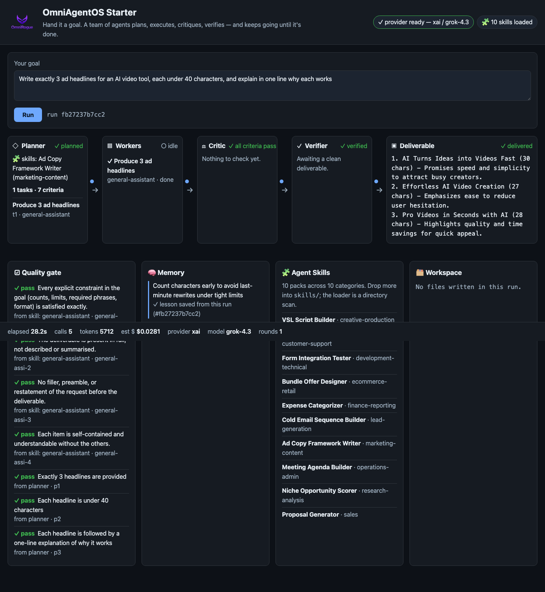

# OmniAgentOS Starter

[](https://github.com/samblakeads/OmniAgentOS-Starter/actions/workflows/ci.yml)

**An assistant waits for you: you prompt it, it answers, it stops. OmniAgentOS
Starter is different — hand it a goal, and a team of agents plans the work,
does the work, checks each other, and keeps going until it's done. On your
machine, with your own API key.**

This is the open orchestration engine behind OmniRogue's AI-agent operating
system: a Planner, a pool of skill-equipped Workers, a Critic, and a Verifier,
looping until the Definition of Done passes or the round cap is hit — all
visible, live, in a no-build dashboard.

## The production line

```
   you type a goal
         │
         ▼
   ┌───────────┐     ┌───────────┐     ┌───────────┐     ┌────────────┐
   │  PLANNER  │ ──▶ │  WORKERS  │ ──▶ │  CRITIC   │ ──▶ │  VERIFIER  │
   │ dod+tasks │     │ (skilled) │     │  verdict  │     │  final ok? │
   └───────────┘     └───────────┘     └─────┬─────┘     └─────┬──────┘
         ▲                                   │ FAIL             │ FAIL
         │                                   ▼                  │
         │                            repair dispatched ◀───────┘
         │                                   │
         └───────────────────────────────────┘  (until PASS or round cap)
                                   │ PASS
                                   ▼
                             deliverable
```

That's not a prompt box. That's a production line: one agent plans, another
generates, another critiques, another verifies — and the system routes work
to the best-fit agent for the job.



## Quickstart

```bash
git clone https://github.com/samblakeads/OmniAgentOS-Starter.git
cd OmniAgentOS-Starter
./start.sh          # macOS / Linux
# .\start.ps1        # Windows
```

`start.sh` / `start.ps1` create a venv if one doesn't exist, install the
package, and open the dashboard for you.

Set one provider key before you start, and the system uses it automatically —
no config file to edit:

```bash
export XAI_API_KEY=...        # xAI grok, checked first
export OPENROUTER_API_KEY=... # or OpenRouter, checked second
export OPENAI_API_KEY=...     # or OpenAI, checked third
```

No key yet? `./start.sh` still opens the dashboard — with no key configured
it shows a first-run panel with a **Replay demo** control that replays a
real, recorded run at paced speed on that same server: every lane, every
event, the full loop, so you can see exactly what it does before you spend a
cent. (The standalone `omniagentos demo` CLI command does the same thing
without a browser, but it starts its own server — don't run it while
`./start.sh` is already serving on the same port, they'll collide.)

## What you get

- **Planner → Workers → Critic → Verifier**, looping until the Definition of
  Done passes or the round cap is hit — visible live as it happens, not a
  spinner.
- **Agent Skills**: drop-in Markdown packs an agent inherits — the workflow,
  the output spec, and the quality gate — the moment they land in `skills/`.
  See the [Skills](#skills) section below.
- **Self-learning memory**: lessons from one run are recalled and cited by
  the next, without you doing anything.
- **A live workspace**: goals that produce files write into a real,
  sandboxed workspace directory you can watch fill in.
- **Local-first**: SQLite memory, no external services beyond your chosen
  LLM provider, binds to `127.0.0.1` by default.

## Skills

Ten sample skill packs ship in `skills/`, one per category (lead-generation,
sales, customer-support, marketing-content, creative-production,
operations-admin, research-analysis, development-technical,
finance-reporting, ecommerce-retail) — MIT-licensed, a working demonstration
of the pack format and the loader. See `skills/README.md` for the format and
the exact list.

The full **OmniRogue Agent Skills Library** — 100+ packs across the same 10
categories — is an OmniRogue Enterprise entitlement. Drop it into `skills/`
and the count rises automatically; the loader is a directory scan, not a
hard-coded list.

## Agents

An agent is a persistent, named identity you hand goals to — a file at
`agents/<slug>.md`: a name, a title, a short persona, a list of skills it's
allowed to draw on, and the tools it can use. Click **Agents** in the header
(scrolls to the section, no page load) to create one from the dashboard —
or drop a file in yourself, same directory-scan loader as `skills/` — then
hand it a goal from the goal box's **Assign to** picker, or by starting the
goal text with `@<slug>`. A picker choice always wins over an `@mention`;
either way, the line under the goal box confirms who the run will execute
as before you press Run. An `@mention` that doesn't resolve to a real (or
enabled) agent is refused outright — `400 UNKNOWN_AGENT` — the run never
starts and the stray text never reaches a prompt.

Its Worker prompt becomes that persona plus its own skills (`skills: []` is
valid — it just defers entirely to the router); its memory is scoped to it,
separate from every other agent's. Omit `tools:` and an agent gets the full
allow-list (`read_file`, `write_file`, `list_files` — there's no shell tool
to grant); set `tools: []` for none, or list a subset — an agent's tools can
only ever be *narrower* than the global allow-list, never wider (a wider
list is rejected). A name is refused outright if it contains `/`, `\`,
`..`, or a NUL byte, never silently reduced to a sanitized slug; the slug a
new agent actually gets combines its name and title. Leave a goal
unassigned and behavior is exactly what it was before agents existed — the
router picks skills the same way it always did. The built-in generalist
agent (`agents/_builtin/general-worker.md`) is always present, its card
reads "built-in · cannot be deleted", and it can't be — only replaced.


Five prebuilt agents ship in `agents/`, one per shipped sample skill:

| Slug | Name / Title | Skills |
|---|---|---|
| `sales-closer` | Cole, Sales Closer | proposal-generator |
| `support-rep` | Ava, Support Rep | refund-request-handler |
| `content-writer` | Max, Content Writer | ad-copy-framework-writer, vsl-script-builder |
| `researcher` | Nora, Researcher | niche-opportunity-scorer |
| `ops-assistant` | Sage, Ops Assistant | meeting-agenda-builder, cold-email-sequence-builder |

CLI: `omniagentos agents list`, `omniagentos agents show <slug>`,
`omniagentos run --agent <slug> "<goal>"`. See `agents/README.md` for the
file format. The full **OmniRogue Enterprise** roster ships more prebuilt
agents on top of the full skills library.

## White-label

Running this under your own brand doesn't require a fork. `OMNIAGENTOS_BRAND_LOGO`
is put directly into the dashboard's ``, so it must be something the
**browser** can fetch, not a bare filesystem path — a plain path like
`/path/to/your-logo.png` will 404 in the browser (the server only serves
`/assets/*`, rooted at the `assets/` directory, not the filesystem root).
Two forms actually work:

```bash
# 1. A real URL (simplest — works from anywhere, no file to place):
export OMNIAGENTOS_BRAND_NAME="Your Brand"
export OMNIAGENTOS_BRAND_LOGO="https://your-cdn.example.com/your-logo.png"

# 2. A local file served by this app: copy it into assets/ first, then
#    reference the /assets/ URL the server actually serves (not the
#    filesystem path you copied it from):
cp /path/to/your-logo.png assets/your-logo.png
export OMNIAGENTOS_BRAND_NAME="Your Brand"
export OMNIAGENTOS_BRAND_LOGO="/assets/your-logo.png"
```

Brand is resolved once at process start — set the env vars **before** you run
`./start.sh` (or `start.ps1`); refreshing the browser on an already-running
server picks up neither a new name nor a new logo, only a restart does. The
dashboard header and `GET /api/health` reflect whatever was resolved at
startup. See `assets/TRADEMARK.md` — the OmniRogue name and logo are not
licensed under this project's MIT license.

## Security

- Binds `127.0.0.1` by default. `--host 0.0.0.0` (e.g. to reach it from
  another device on your LAN) requires `OMNIAGENTOS_TOKEN`. Open the
  dashboard once as `http://host:port/?token=<token>` — the page exchanges
  it for a same-origin cookie and scrubs it from the address bar, so you
  don't paste it again. API clients can send `Authorization: Bearer <token>`
  instead.
- No shell/exec tool anywhere — agents can only read/write inside a
  per-run, sandboxed workspace directory.
- Provider keys never appear in logs, events, or API responses — every
  user-facing string is redacted first.

See `SECURITY.md` for the full policy and how to report a vulnerability.

## Looking for more?

This repo is the open orchestration engine — the loop, the skills format,
the local dashboard. The full platform adds 10,000+ agents, hosted
infrastructure, SeeDance/voice generation, white-label deployment, and the
complete Agent Skills Library.

**Looking for the full research-grade system? → https://github.com/omnirogue/OmniAgentOS**

## Contributing

See `CONTRIBUTING.md`. Bug/feature templates live under
`.github/ISSUE_TEMPLATE/`.

## License

MIT — see `LICENSE`. The OmniRogue name and logo are trademarks of OmniRogue
Inc and are not covered by the MIT grant; see `assets/TRADEMARK.md`.
